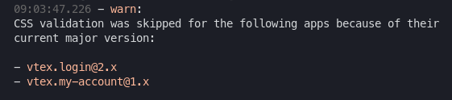

### Selectores

A fin de mejorar la estabilidad del sitio VTEX limitó el uso de selectores CSS

[Selectors Whitelist](https://vtex.io/docs/releases/2019-week-43-44/css-selectors-deprecation/)

!!! warning
    En algunas apps y durante una versión major determinada aún no existe esta limitación,  
    verán un mensaje de este tipo al hacer `vtex link`

    

---

## Tachyons

Framework utilizado por VTEX para traducir sistemas de diseño a CSS

En todos los Store-Framework vamos a ver que en la carpeta `styles/configs` hay un json llamado `style`  

Esta es la tabla que va a ser traducida en clases HTML.  

Ej:  
La clase `mh2` (horizontal) se traduce en  
_margin-left: var(--spacing-small)_  
_margin-right: var(--spacing-small)_  

Donde --spacing-small es la posicion correspondiente en el arreglo de `spacing`  
<small>Todas las medidas utilizadas son **relativas**, o porcentuales en el layout</small>

!!! info
    La mayoria de los componentes nativos aceptan props para insertar estilos sin necesidad de utilizar CSS.  
    Referirse a los lineamientos de esta documentacion y como ejemplo, la app vtex.flex-layout que demuestra estas
    capacidades.

### Sobre Tachyons

<small>¡Afortunadamente VTEX ya nos provee de un builder para implementar nuestros propios sistemas!</small>

[Aprende sobre el framework](https://tachyons.io/)  
[Aprende como desarrollarlo](https://github.com/dwyl/learn-tachyons)

---

## Styleguide

VTEX nos provee de su sistema de diseño, para poder crear APPs orientadas a su imagen.  

Por supuesto que tambien podemos utilizarla para estilizar nuestras apps dentro del front de la tienda.  

[Styleguide](https://styleguide.vtex.com/)
