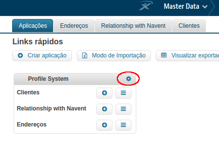
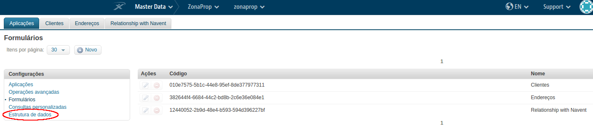
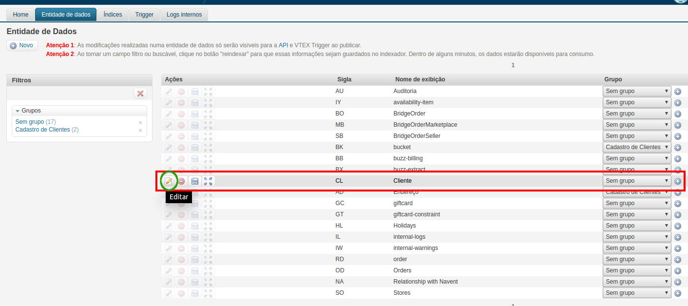
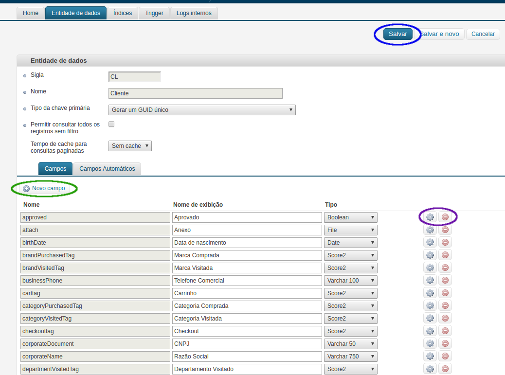
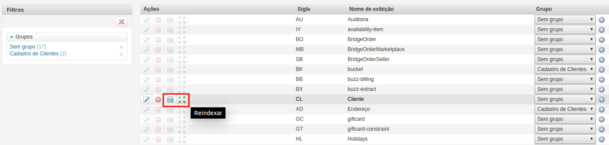
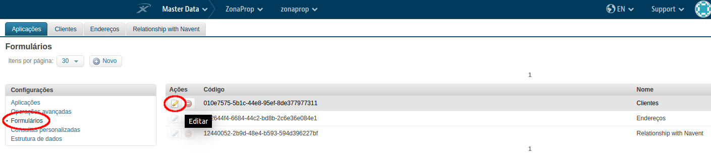
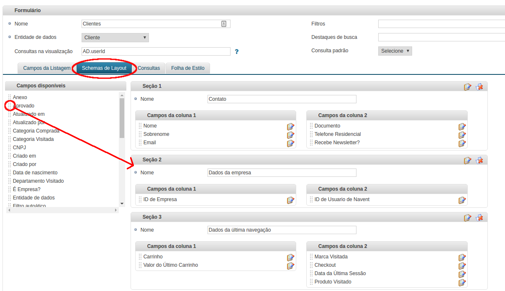

**URL Masterdata:** `http://{environment}.vtexcrm.com.br`  

## ¿Que es Masterdata V1?

Es el módulo de la plataforma VTEX que permite crear arquitecturas de bases de datos para una tienda. No hay limite de las entidades que se puedan crear, ni de la informacion que se almacena en ellas  

[Saber más](https://help.vtex.com/es/tutorial/master-data-v2--3JJ1mlzuo88w22gO0gy0QS)

---

## Modificar Data Entity

Seleccionar el &iacute;cono de engranaje al lado de &quot;profile system&quot;.  

{:align=center}

Se abrir&aacute; una nueva p&aacute;gina con una barra de opciones a la izquierda. Seleccionar &quot;Estructura de dados&quot;  

{:align=center}

Se desplegar&aacute; una lista con todas las data entities existentes. Seleccionar de la lista, la data entity que se quiere modificar y hacer click en el bot&oacute;n &quot;editar&quot;.  

{:align=center}

Se listar&aacute;n todos los campos que forman la data entity y las acciones disponibles para editar los campos existentes o crear nuevos.  

{:align=center}

Para ver reflejados los cambios, es necesario reeindexar y publicar la data entity, con las acciones indicadas en la siguiente im&aacute;gen:

{:align=center}

---

## Modificar Formulario de una Data Entity

Seleccionar el &iacute;cono de engranaje al lado de &quot;profile system&quot;.  

{:align=center}

Se abrir&aacute; una nueva p&aacute;gina con una barra de opciones a la izquierda. Seleccionar &quot;Formularios&quot; y hacer click en el bot&oacute;n &quot;editar&quot;.

{:align=center}

Seleccionar la tab &quot;schemas de layout&quot;. A la izquierda se muestra una lista desde la cual se pueden arrastrar campos (haciendo click en los :::) hacia las secciones donde queremos que se muestren y de esa forma customizar el formulario.

{:align=center}